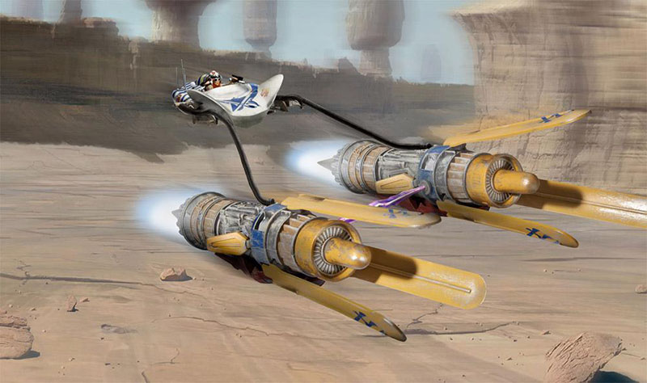
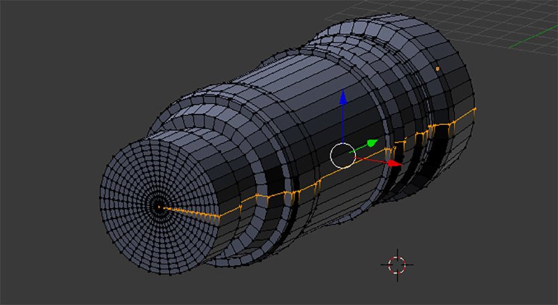
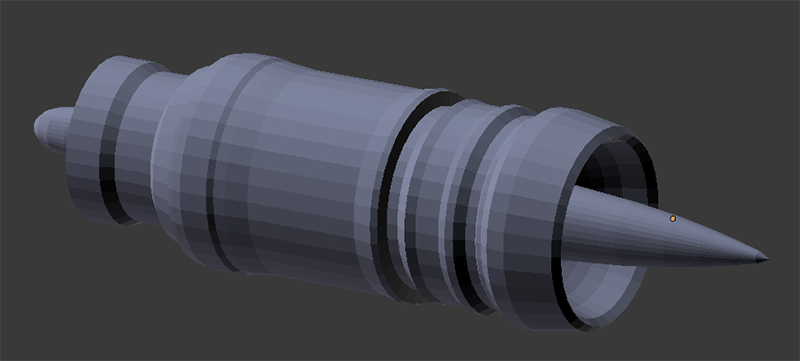
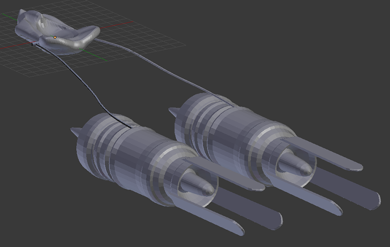

# Práctica 1: Modelado con Blender

> Francisco Javier Bolívar Lupiáñez

## Objetivo

El objetivo de esta práctica es realizar un modelo con Blender.

He elegido realizar una vaina de carreras (*podracer*) como las que se pudieron ver en la película *Star Wars: Episodio I - La amenaza fantasma*. Inspirándome en uno de los juegos de mi infancia: *Star Wars Racer*:

Como se puede ver es un modelo bastante complejo pero se puede simplificar en varios niveles, desde un cubo para la cabina y varios cilindros para los motores y cables hasta, como se ha hecho, algo más complejo modelando con algo más de precisión la cabina y generando por revolución los motores a partir de un perfil más realista.

## Proceso de diseño

### Cabina

Lo primero que se realizó fue quizás lo más complicado: la cabina donde se instala el piloto. Se ha simplificado bastante pues no se ha creado ni un modelo del piloto ni de los mandos.

Para modelarla se ha partido de una esfera subdividida en 128x64, la cual se ha redimensionado en el eje vertical (en Blender Z). 

Para moldearla se ha utilizado el *Proportional Editing Mode* que proporciona Blender que nos ayuda a modelar pues arrastrando de un vértices arrastra de los que están cerca (se puede modificar esa función de cercanía según se quiera).

Una vez modelado se han seleccionado todos los vértices y se han suavizado con la opción de *Smooth Vertex* obteniendo el siguiente resultado:

### Motores

Con la cabina preparada era turno de realizar las otras dos grandes piezas del modelo: los motores. Para realizarlos se ha utilizado la técnica de generación por revolución a partir de un perfil.

Se ha definido el siguiente perfil:

Con el que se ha generado el siguiente objeto por revolución:

Se han eliminado los vértices duplicados y se han editado los extremos para hacerlos más parecidos a los reales utilizando el *Proportional Editing Mode* que ya se utilizó para realizar la cabina:

Este motor se ha duplicado para tener tanto el derecho como el izquierdo.

Posteriormente y siguiendo la misma filosofía de duplicar se han creado las aletas de los motores a partir de un cubo que se ha redimensionado y subdividido en el extremo para generar esa forma curvada que tienen.

### Cables

Ya con los motores, el modelo comienza a coger forma pues solo quedan varios cilindros que unen la cabina con los motores, tan finos que se notan poco pero que están ahí, y por tanto, hay que modelar.

Para ello se ha partido de un cilindro y se ha subdividido como se muestra [aquí](https://camo.githubusercontent.com/b6fc7e1e1f3d6d0183cfcbca2ccccd78ca07ecdb/68747470733a2f2f692e737461636b2e696d6775722e636f6d2f7770376c382e676966). Para poder modelar las curvas.

Una vez creado uno, se ha creado el otro duplicando y volteándolo usando la función *Mirror* sobre el eje X para que sea simétrico.

Dejando este modelo que podría ser el definitivo:

### Retoques

#### Tamaño de motores

Al comparar el modelo generado con el real nos podemos dar cuenta de una cosa fácilmente: los motores son demasiado grandes. Por lo que lo que el primer retoque que he realizado ha sido el redimensionarlos para que su tamaño en proporción con la cabina sea el más parecido posible al real.

#### Rayo de luz de energía

Además se ha creado el rayo de luz rosa muy simplificado pues se ha modelado como un cilindro fino.

## Resultado

El modelo final es bastante parecido al real, pero con las simplificaiones que se han comentado anteriormente:

Se ha exportado a STL y se ha subido a Sketchfab para que cualquiera lo pueda visualizar desde un navegador. Para ello pulsar en este [enlace](https://skfb.ly/6nKTP).