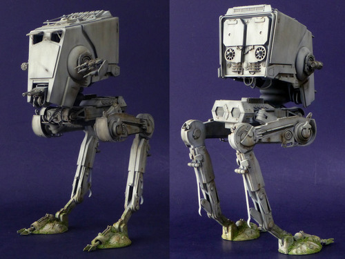
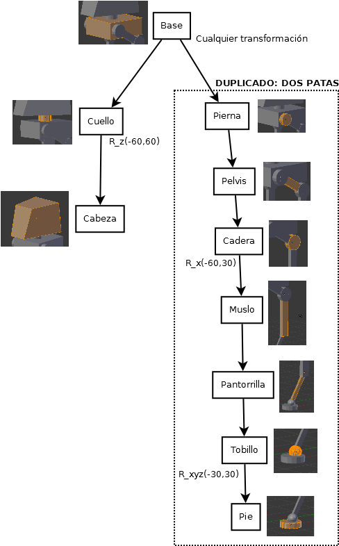
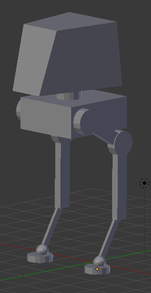

# Práctica 2: Creación de modelos

> Francisco Javier Bolívar Lupiáñez

## Objetivo

El ojbetivo de esta práctica es realizar un modelo jerárquico con Blender. 

Habría utilizado el de la práctica pasada, pero se quedaba bastante pobre de articulaciones. Por eso he elegido realizar un robot de asalto (*AT-ST*) como los que se pudieron ver en la película *Star Wars: Episodio VI - El retorno del Jedi*.

Como se puede ver es un modelo bastante complejo pero se puede simplificar bastante utilizando prismas, cilindros y escenas.

## Proceso de diseño

### Modelo

El modelo tiene cabeza, cuello, base y dos patas idénticas (se ha creado una que posteriormente se ha duplicado). Para modelar se han utilizado cubos, esferas y cilindros que se han transformado debidamente.

### Jerarquía

Una vez creado el modelo se ha establecido la jerarquía padre-hijo que se muestra en el siguiente grafo (en el que se muestra también los movimientos permitidos con sus restricciones):

Se han simplificado los movimientos y se han obviado algunas articulaciones para no hacer demasiado tedioso el trabajo.

## Resultado

El resultado final es el siguiente:

