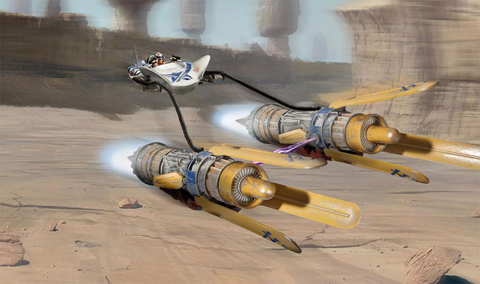
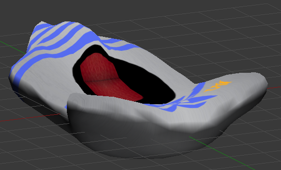
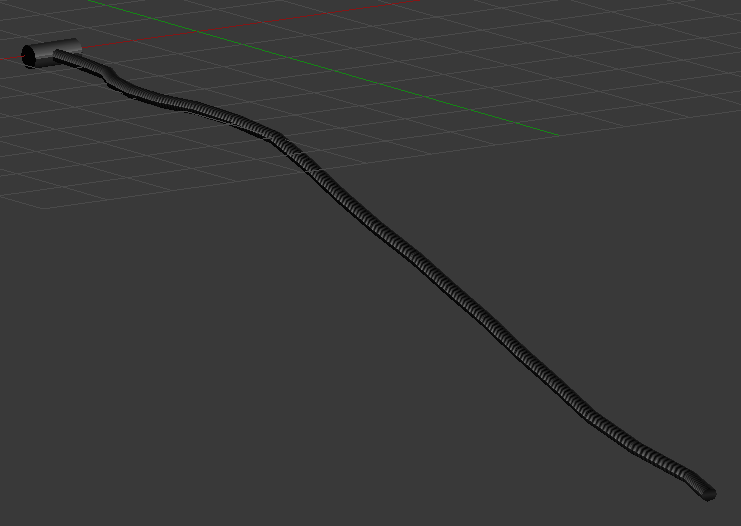
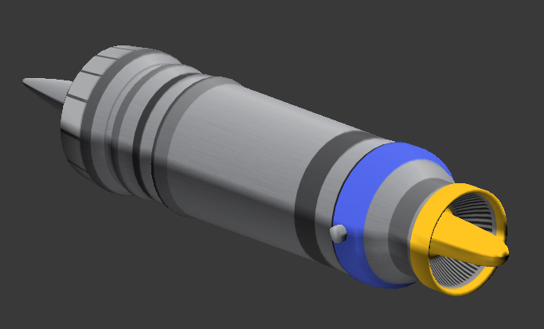
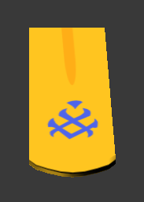
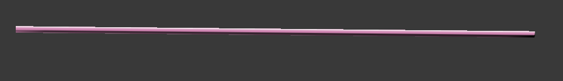
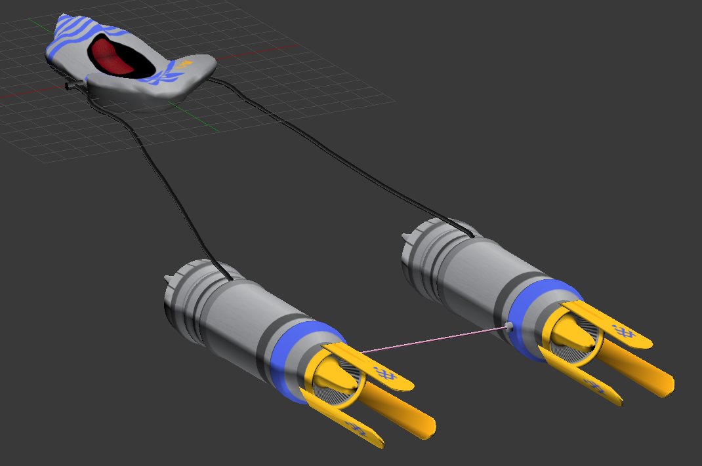

# Práctica 3: Texturas

> Francisco Javier Bolívar Lupiáñez

## Objetivo

El objetivo de esta práctica es texturizar un modelo ya creado con Blender.

He elegido modelar la vaina de carreras (*podracer*) como las que se pudieron ver en la película *Star Wars: Episodio I - La amenaza fantasma* que yá modelé en la [primera práctica](P1):

## Proceso de diseño

### Cabina

Empecé con lo que quizás era más complicado, la cabina. Esta tenía muchísimos polígonos, pues para modelar me era más cómodo, pero para mapear texturas podría resultar una odisea. Por ese motivo, decidí simplificar la malla. Para ello, usando MeshLab, hice una *Quadric Edge Collapse*. Ya con la malla simplificada me puse manos a la obra con la textura.

La creé a partir de una textura metalizada a la que fui añadiendo detalles como el asiento y distintos dibujos. Como estos detalles solo están en la parte superior de la cabina, creé dos versiones de la textura para que conservasen la simetría y generé las coordenadas de textura mediante proyección editando a mano algunos vértices.

### Cables

Para los cables creé una textura que se repite por cada segmentación del tubo para reducir el tamaño de la imagen lo máximo posible. Para mapear generé las coordenadas de textura a partir de una forma cilíndrica y ya los fui editando para colocarlos en los píxeles exactos de la textura.

Para la parte del cable que se conecta a la cabina usé otra versión de la textura del cable en la que no había detalles de pliegues.

### Motores

Los motores, al haberse generado mediante revolución se pueden tratar, a la hora de texturizar, como cilindros y eso he hecho, generando las coordenadas de textura para esta forma geométrica.

### Aletas

Las aletas son prácticamente de un único color a excepción de un pequeño dibujo, por lo que creé una imagen de un color plano y el detalle del dibujo. Generé las coordenadas de textura mediante proyección y las retoqué para que se ajustasen perfectamente a la imagen.

Para que la parte posterior de las texturas no tuviese imagen y fuese de un color sólido único redimensioné las coordenadas de textura para que abarcasen una zona donde solo estaba este color.

### Rayo de luz de energía

El rayo de luz era la malla más simple pues era un cilindro y generar las coordenadas de textura ha sido trivial haciendo que se generen para esta forma.

## Resultado

El modelo final es bastante parecido al real, aunque bastante simplificado:

Se ha exportado a OBJ y se ha subido a Sketchfab para que cualquiera lo pueda visualizar desde un navegador. Para ello pulsar en este [enlace](https://skfb.ly/6nKTP).