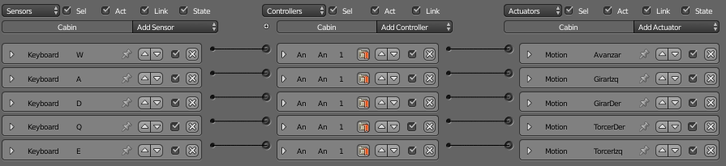

# Práctica 4: Interacción

> Francisco Javier Bolívar Lupiáñez

## Objetivo

El objetivo de esta práctica es aprender a construir entornos interactivos con Blender.

He elegido dar interacción a la vaina de carreras (*podracer*) como las que se pudieron ver en la película *Star Wars: Episodio I - La amenaza fantasma* que yá modelé en la [primera práctica](P1) y di terxturas en la [tercera práctica](P3):

## Proceso de diseño

### Tareas previas

En primer lugar cambié las propiedades del mundo (gravedad 0) y del objeto (*rigid body*):

Di jerarquía al objeto en forma de padre hijo entre los distintos componentes, pues la práctica 2 la hice con otro modelo:

Y apliqué todas las transformaciones para evitar fallos en la visualización en el modo juego. Una vez hecho todo esto podía pasar finalmente a editar la interacción.

### Movimiento del avatar

La interacción que realicé fueron los movimientos básicos que podemos encontrar:

* Avanzar (Trasladar eje Y+)
* Girar derecha (Giro eje Z+)
* Girar izquierda (Giro eje Z-)
* Torcer derecha (Giro eje Y+)
* Torcer izquierda (Giro eje Y-)

Pulsando las teclas W, A, D, Q y E respectivamente:

Se intentó que al torcer se fuese directamente a los 90º al pulsar la tecla y volviese al estado original al dejar de pulsarla, pero no había forma de hacerlo con una transición suave sin utilizar *scripts* por lo que se decidió finalmente hacerlo incremental y que el usuario volviese al estado original manualmente.

### Movimiento de la cámara

En primer lugar hay que activar la cámara para que sea la utilizada en el modo juego. Para ello hay que añadirle un sensor *always* a un actuador *scene* y en el modo *set camera* elegirla.

Para que siga al objeto, tan solo he tenido que hacer que herede de él para que siga sus movimientos.

