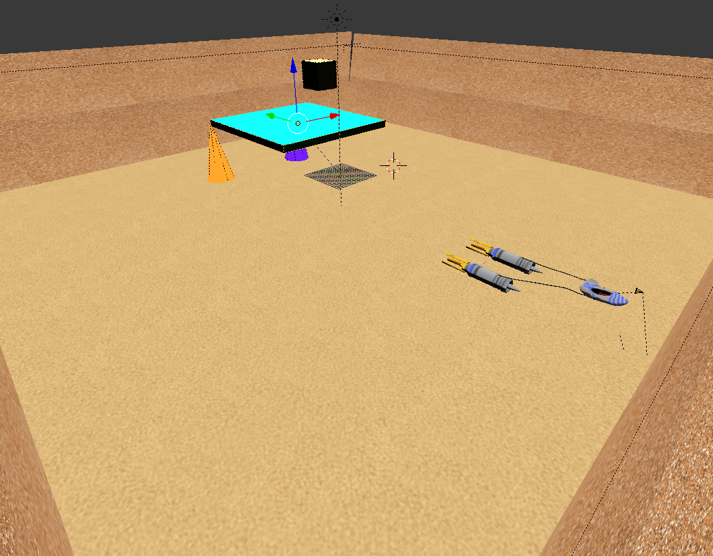
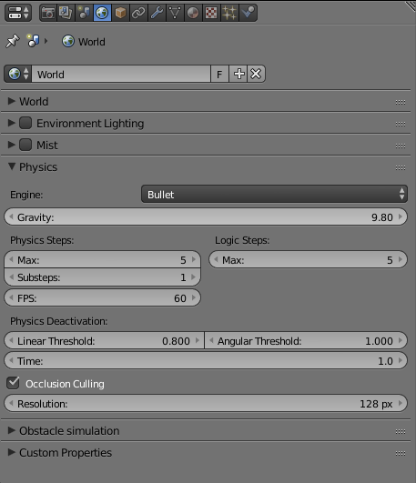
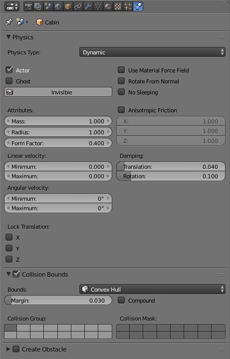
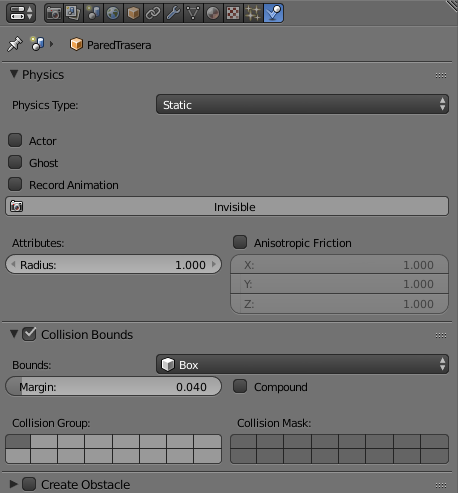
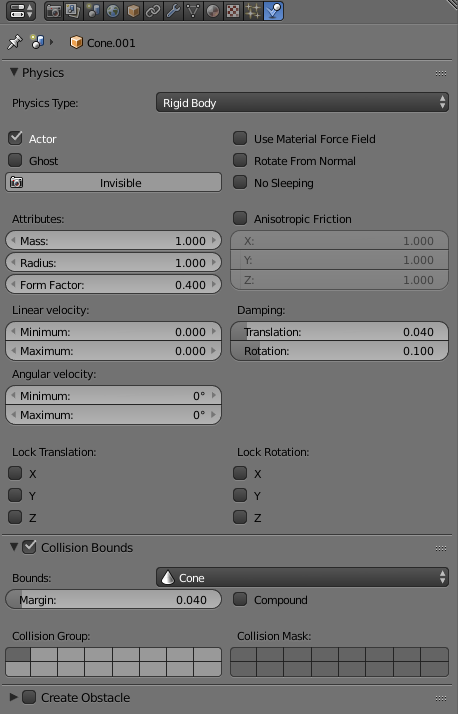
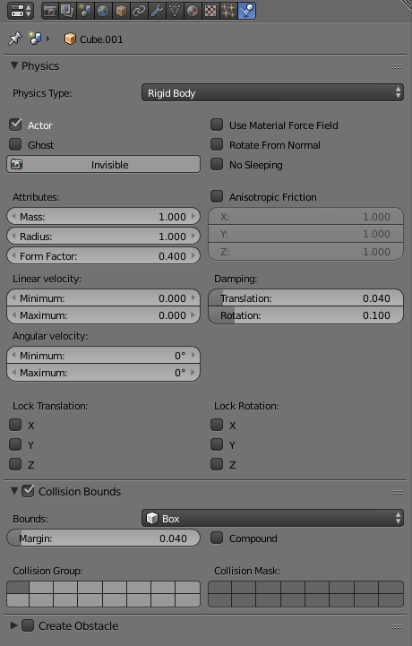
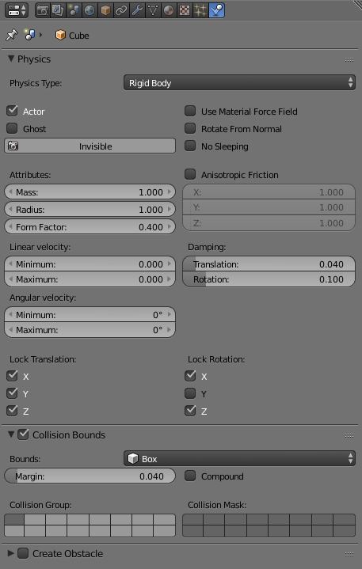
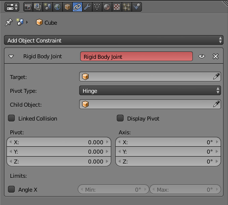

# Práctica 5: Simulación

> Francisco Javier Bolívar Lupiáñez

## Objetivo

El objetivo de esta práctica es aprender a utilizar el motór de física de Blender.

He elegido dar física a la vaina de carreras (*podracer*) como las que se pudieron ver en la película *Star Wars: Episodio I - La amenaza fantasma* que yá modelé en la [primera práctica](P1) y di terxturas en la [tercera práctica](P3):

Para ello se ha creado un escenario cuadrado cerrado por paredes y varios objetos que se describirán más tarde.

## Proceso de diseño

### Propiedades del mundo

Las propiedades del mundo son las siguientes:

### Avatar

Como no se hacía uso del modelo jerárquico como tal, se han unido todo es uno para que a la hora de calcular las colisiones sea más sencillo.

Las propiedades del avatar son las siguientes:

### Objetos estáticos

Se han creado un cuatro paredes y un suelo con las siguientes propiedades:

De esta forma no se podrán atravesar y harán de límites de la escena.

### Objetos dinámicos

Se han creado un par de conos con las siguientes propiedades:

Al colisionar con ellos se podrán tumbar y desplazar.

### Objetos con restricciones

Como restricción se ha creado una bisagra que al inicio de la escena se puede ver funcionando ya que cae un cubo sobre ella.

El cubo que cae tiene las siguientes propiedades:

Y la bisagra:

A la que también se le ha añadido el siguiente *constraint*:

