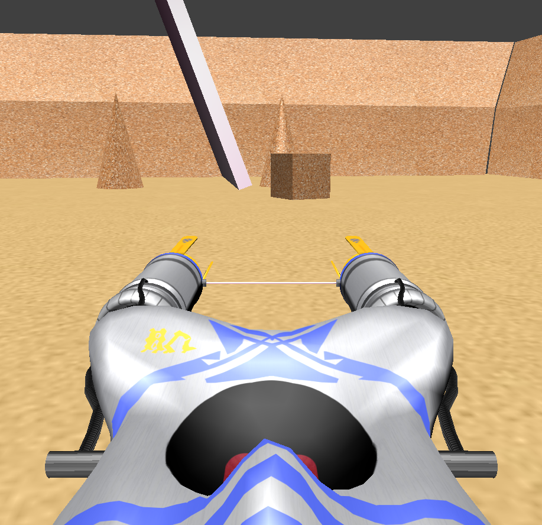

# Práctica 6: Proyecto

> Francisco Javier Bolívar Lupiáñez

## Objetivo

El objetivo de esta práctica es crear un entorno virtual integrando los trabajos realizados en las prácticas anteriores.

## Resultado

Como ya se ha ido integrando todo conforme se ibana avanzando las prácticas, lo único que he hecho en esta ha sido agregar texturas a todos los objetos y mantener la interacción de la práctica anterior con el modelo que se creó originalmente.

